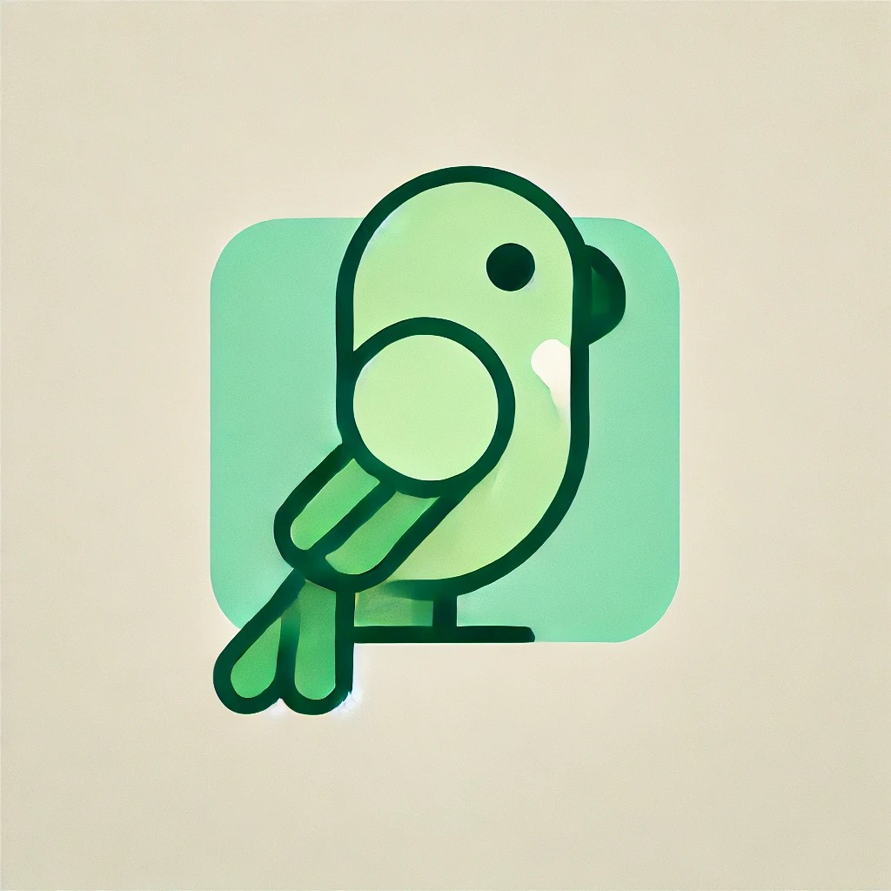

<h1 align="center">
   
    The Tuim Project
</h1>

> [!CAUTION]
> The Tuim Project is a work in progress.
> For now it is designed only for test purposes.

## About the project

The Tuim Project is a work in progress aiming to provide a cross-platform
Application Binary Interface (ABI) and library ecosystem.

Visit the official web page <https://ismaeldamiao.github.io/tuim/>.

## License

The Tuim Project is released under the MIT License.
See the **[LICENSE](LICENSE)** file for details.

## Author

The Tuim Project was created by
**[I. F. F. dos Santos](https://github.com/ismaeldamiao)**.

## Join the community

There is a official community in [Discord](https://discord.gg/XmHuXpS98A).

If you want to contribute with the project then place a pull a request
or send a e-mail to [ismaellxd@gmail.com](mailto:ismaellxd@gmail.com).

## Donations

Did you like the project? Make a donation so that I can continue working on it.

- **GitHub Sponsors**: https://github.com/sponsors/ismaeldamiao
- **PayPal**: <https://www.paypal.com/cgi-bin/webscr?cmd=_s-xclick&hosted_button_id=D66EM3DGU35EE>.
- **PIX**: `ismaellxd@gmail.com`.
